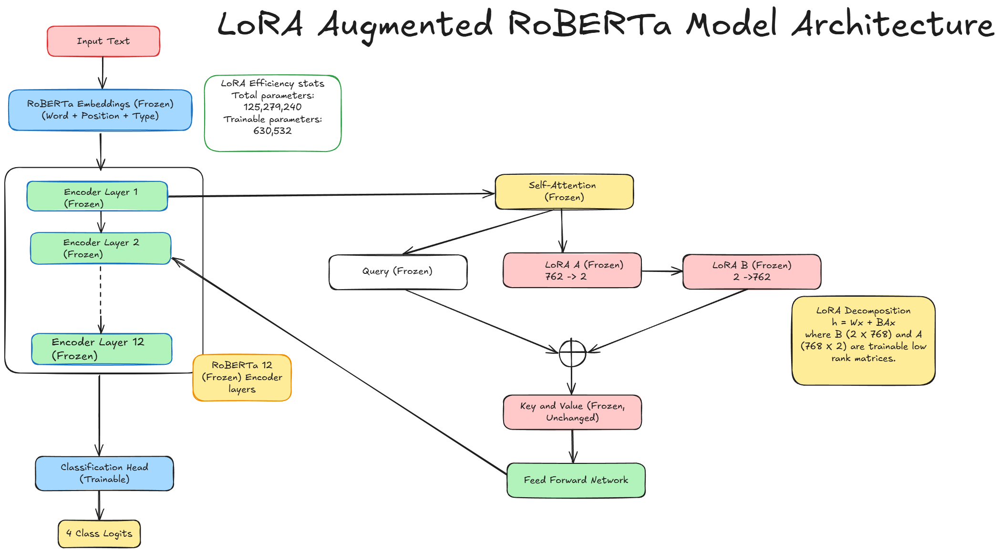
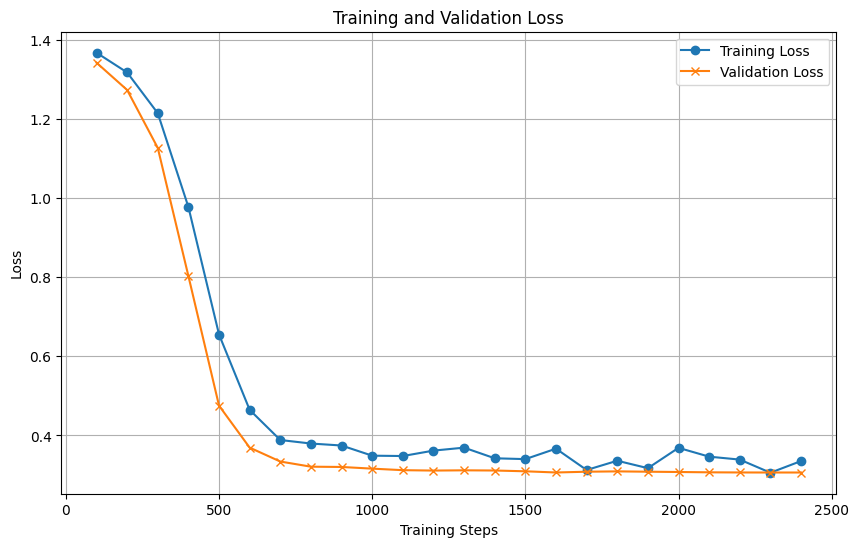
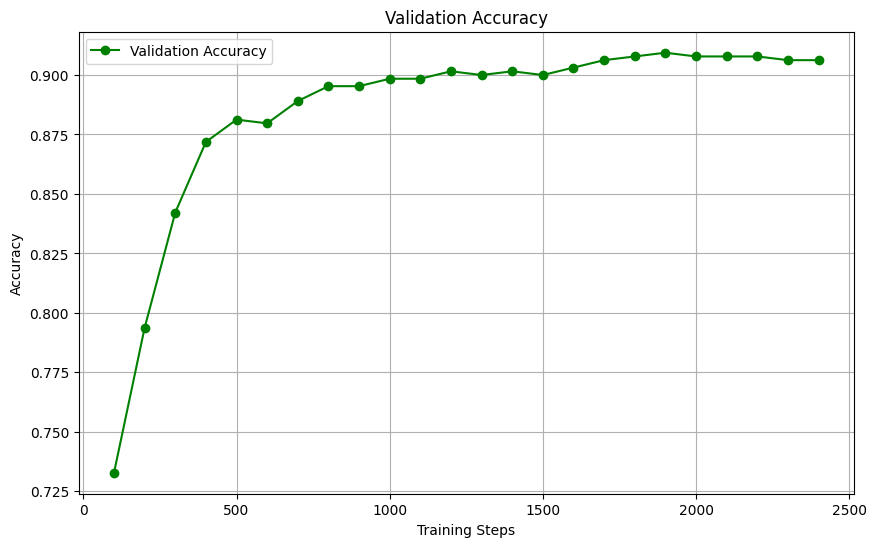

# Parameter-Efficient Fine-Tuning with LoRA on RoBERTa

This repository demonstrates parameter-efficient fine-tuning of RoBERTa for text classification using Low-Rank Adaptation (LoRA). The project shows how to achieve high performance while training only 0.5% of the model's parameters.

## Overview

The main notebook [roberta_lora_final_project2.ipynb](roberta_lora_final_project2.ipynb) implements a complete workflow for efficient fine-tuning of the RoBERTa model on the AG News classification dataset using LoRA, a parameter-efficient fine-tuning technique.

## LoRA Architecture

The architecture visualized above shows how LoRA works by inserting trainable low-rank matrices into the query component of attention layers. The approach follows the formula h = Wx + BAx, where:
- W represents the frozen pre-trained weights
- B (2×768) and A (768×2) are trainable low-rank matrices
- Only 630,532 parameters (0.5% of the total 125M) are trained

## Training Results

The model was trained for 2400 steps, achieving over 90% validation accuracy:

The plots show:
1. Both training and validation losses decreasing rapidly in the first 600 steps
2. Validation accuracy climbing from 73% to over 90%
3. No signs of overfitting, with validation loss remaining lower than training loss

## Project Components

- **Data Preprocessing**: Tokenization and preparation of AG News dataset for classification
- **LoRA Configuration**: Setup of rank-2 LoRA adapters targeting only query matrices
- **Training**: Efficient fine-tuning using Hugging Face Trainer API
- **Evaluation**: Testing the model on labeled and unlabeled data
- **Inference**: Running predictions on new text inputs

## Key Features

- Demonstrates how to adapt large language models efficiently with minimal parameters
- Provides visualization and analysis of model architecture and training dynamics
- Shows complete workflow from data preparation to inference
- Achieves high accuracy (>90%) despite updating only 0.5% of parameters

## Requirements

The project requires the following libraries:
- transformers
- datasets
- evaluate
- accelerate
- peft
- trl
- bitsandbytes
- matplotlib
- pandas
- torch

## Usage

1. Clone the repository
2. Open the main notebook [roberta_lora_final_project2.ipynb](roberta_lora_final_project2.ipynb)
3. Run the cells to train the model or load pre-trained checkpoints
4. Use the inference functions to run predictions on new text

## Checkpoints

The repository includes saved checkpoints at different training steps:
- checkpoint-500
- checkpoint-1000
- checkpoint-1500
- checkpoint-2000
- checkpoint-2400 (final)

These can be loaded to resume training or perform inference without retraining.

## Acknowledgements

This project is based on the following techniques and tools:
- RoBERTa model from Hugging Face Transformers
- LoRA method for parameter-efficient fine-tuning
- PEFT library for implementation of efficient fine-tuning techniques
